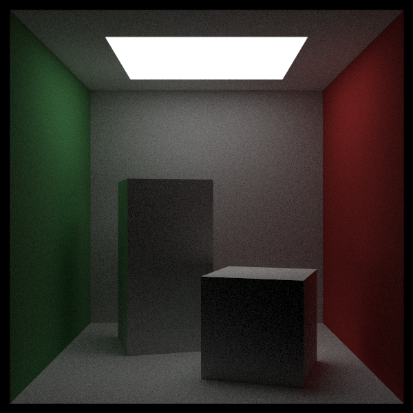
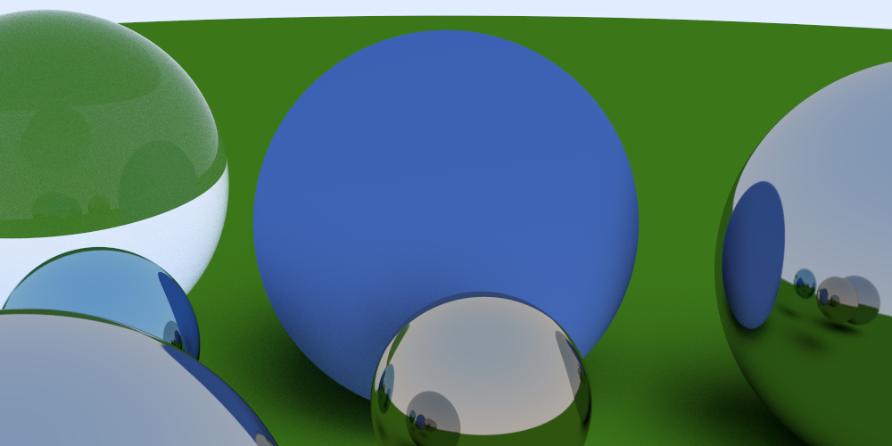
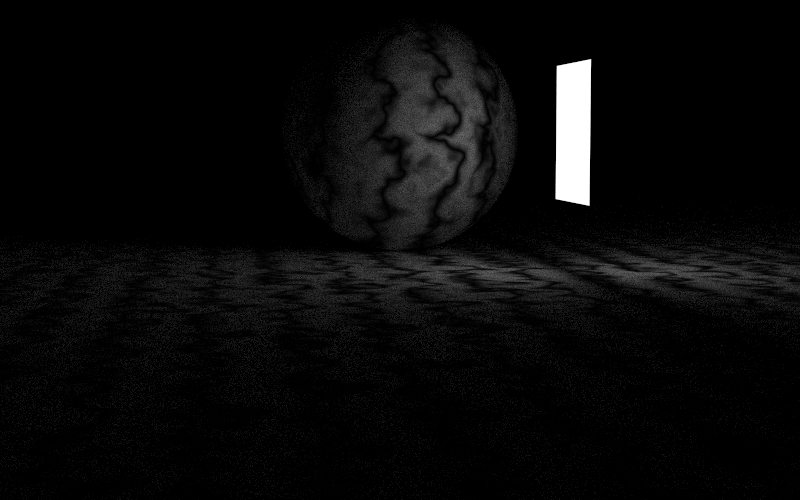
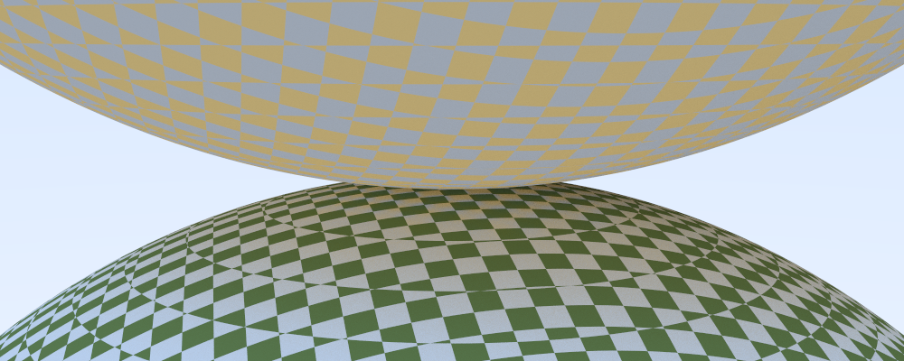

# About
This repository was first crafted with the steps from [Ray Tracing In One Weekend](https://raytracing.github.io/books/RayTracingInOneWeekend.html#overview) and the follow-on series. It also includes important type aspects from the blogpost about [Type-Safe Ray Tracing](https://ajeetdsouza.github.io/blog/posts/type-safe-raytracing-in-modern-cpp/). I have updated it to follow "modern C++ standards" (a continuous effort), and also added several more features listed below. Example scenes and images are also provided.

# TODOs:
- Unit testing.
- Look into magic number cases and either change or document appropriately.

# Features
- Demonstration using PPM image file. Provides different "scenes" to play around with as well.
- Single value_type to allow client to switch between double, float, etc.
- Abstract material class to allow for different materials. Current materials include lambertian, metallic, and dielectric (clear).
- Abstract texture class to allow for different textures. Current textures supported are single-color and checkered pattern.
- Abstract hittable class to allow for different shapes. Currently supports triangles, square pyramids, spheres, rectangles, and blocks.
- Type safe vectors.
- Positionable camera with defocus blur.

# Examples
- The Cornell Box. [[Reference](https://www.graphics.cornell.edu/online/box/history.html)]

- Six spheres in a triangular formation.

- Perlin noise.

- Checkered texture.

