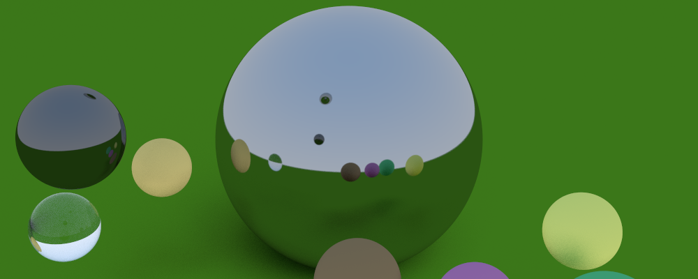
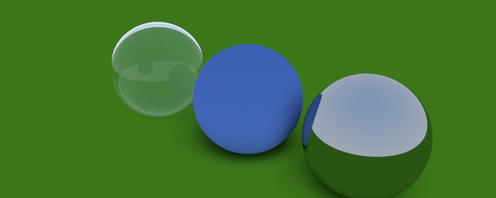

# About
This repository follows the steps from [Ray Tracing In One Weekend](https://raytracing.github.io/books/RayTracingInOneWeekend.html#overview). It also includes talking points from the blogpost about [Type-Safe Ray Tracing](https://ajeetdsouza.github.io/blog/posts/type-safe-raytracing-in-modern-cpp/).

# Features
- Demonstration using PPM image file. Provides several different "scenes" to play around with as well.
- Single value_type to allow client to switch between double, float, etc.
- Abstract material class to allow for OOP approach to different materials. Current materials include lambertian, metallic, and dielectric (clear).
- Abstract hittable class to allow for different shapes to be included. Currently only supports spheres.
- Type safe vectors.
- Positionable camera with defocus blur.

# Examples
- Six spheres in a triangular formation.

- Reflections on metallic material.

- Three spheres from L to R: Dielectric, Lambertian, Metallic

