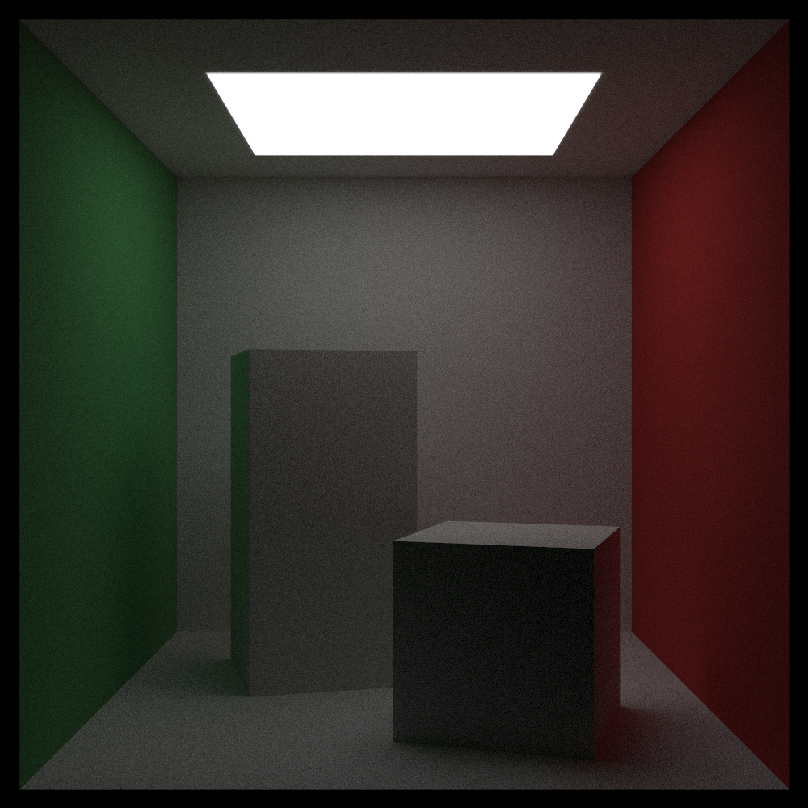

# About
This repository follows the steps from [Ray Tracing In One Weekend](https://raytracing.github.io/books/RayTracingInOneWeekend.html#overview). It also includes talking points from the blogpost about [Type-Safe Ray Tracing](https://ajeetdsouza.github.io/blog/posts/type-safe-raytracing-in-modern-cpp/).

# TODOs:
- Unit testing.
- Update AABB to use Andrew Kensler's faster method using  std::swap().
- Look into magic number cases and either change or document appropriately.
- Create Triangle object and Pyramid object. Test accordingly.

# Features
- Demonstration using PPM image file. Provides several different "scenes" to play around with as well.
- Single value_type to allow client to switch between double, float, etc.
- Abstract material class to allow for different materials. Current materials include lambertian, metallic, and dielectric (clear).
- Abstract texture class to allow for different textures. Current textures supported are single-color and checkered pattern.
- Abstract hittable class to allow for different shapes. Currently supports spheres, rectangles, and blocks.
- Type safe vectors.
- Positionable camera with defocus blur.

# Examples
- The Cornell Box. [[Reference](https://www.graphics.cornell.edu/online/box/history.html)]

- Six spheres in a triangular formation.

- Checkered Texture.

